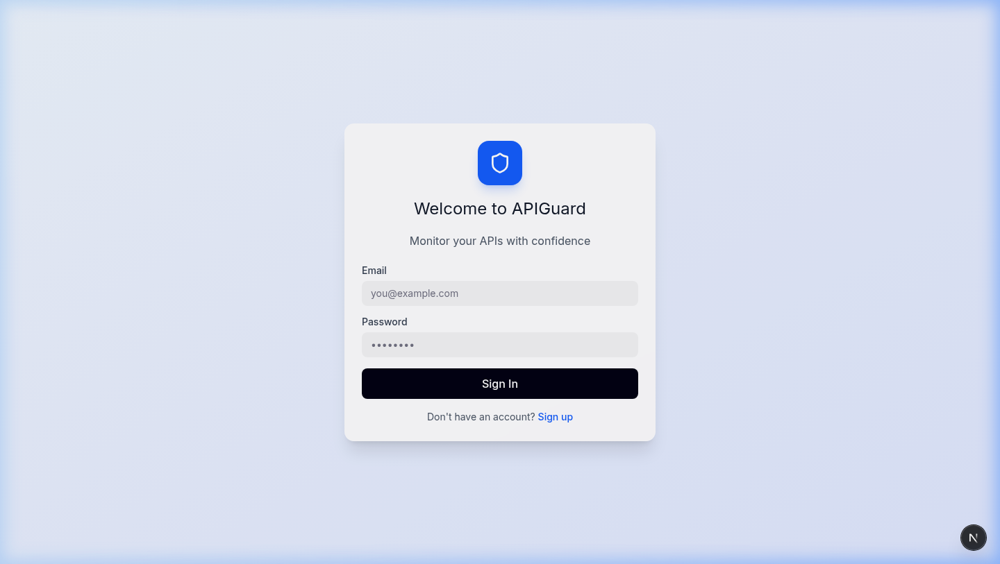
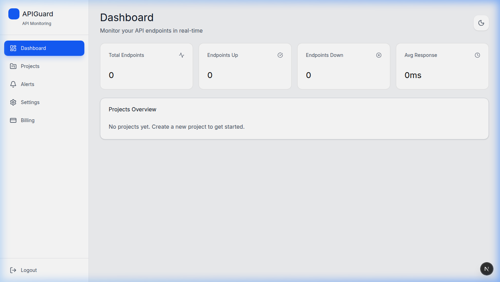
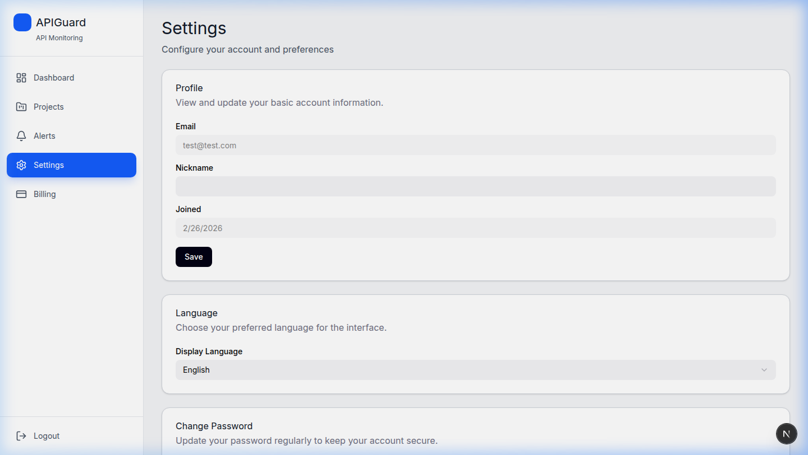
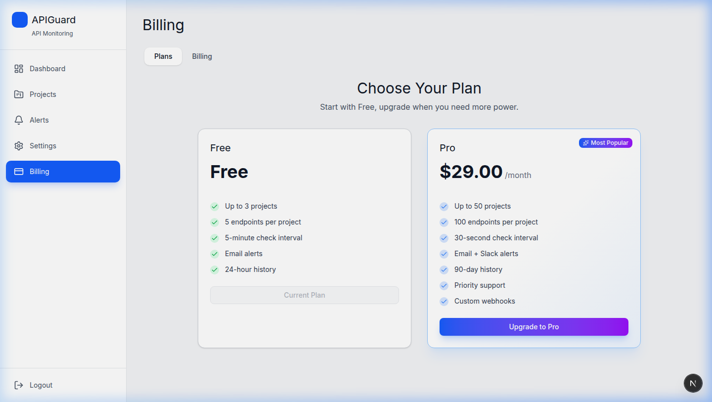

# APIGuard

APIGuard는 외부 API 의존성이 있는 서비스 팀을 위한 **API Reliability & Contract Change Detection SaaS**입니다.

프론트엔드는 Endpoint 상태, 응답 시간, Incident, 알림 정책, OpenAPI breaking change 이력을 확인하는 운영 콘솔입니다.  
워크스페이스 기반 멀티테넌시와 RBAC, 플랜 사용량 화면까지 포함해 실제 SaaS 관리 경험에 맞춰 설계했습니다.

> **Backend repo**: [apiguard-backend](../apiguard-backend)

---

## Problem

서비스는 점점 더 많은 외부 API에 의존합니다. 하지만 외부 API 장애, 응답 지연, 계약 변경은 내부 배포 없이도 서비스 장애로 이어질 수 있습니다.

APIGuard는 이러한 문제를 해결하기 위해 API 상태를 주기적으로 검사하고, 장애 이력과 OpenAPI 계약 변경 이력을 함께 관리하는 개발팀용 API Reliability SaaS입니다.

## Key Scenarios

1. 외부 API Endpoint 등록
2. 주기적 상태 체크와 응답 시간 기록
3. 연속 실패 발생 시 Incident 생성
4. Redis cooldown 기반 중복 알림 방지
5. OpenAPI snapshot 비교
6. Breaking Change 감지와 계약 변경 이력 확인
7. 공개 Status Page로 외부 공개 상태 관리

## Positioning

APIGuard는 보안 스캐너나 단순 상태 체크 앱이 아닙니다. 외부 API 의존성이 있는 개발팀이 장애, 응답 지연, 계약 변경을 한 화면에서 추적하도록 만든 **Reliability & Contract Change Detection 도구**입니다.

---

## Screenshots

<table>
  <tr>
    <td></td>
    <td></td>
  </tr>
  <tr>
    <td align="center">Login</td>
    <td align="center">Dashboard</td>
  </tr>
  <tr>
    <td></td>
    <td></td>
  </tr>
  <tr>
    <td align="center">Settings</td>
    <td align="center">Billing & Plans</td>
  </tr>
</table>

---

## Tech Stack

- **Next.js 16** (App Router + React Compiler, production build는 Webpack 모드)
- **React 19** / TypeScript 5
- **Node.js 24** / **pnpm 11.1.3**
- **TailwindCSS 4** + CSS Variables로 디자인 토큰 관리
- **Pretendard** self-hosted variable font
- **Radix UI** / shadcn/ui — 접근성 확보된 UI 컴포넌트
- **Recharts** — 응답 시간·업타임 시각화
- **Framer Motion** — 페이지 전환, 마이크로 인터랙션
- **Axios** — 인터셉터 기반 JWT 자동 갱신
- **next-intl** — 한/영 다국어
- **next-themes** — 다크모드
- **pnpm** workspace

---

## Features

### 인증

JWT Access/Refresh Token 기반. Axios 인터셉터에서 401 응답 시 자동으로 토큰을 갱신하고 원래 요청을 재시도합니다.

### 워크스페이스 & RBAC

워크스페이스 단위로 데이터가 격리되고, 역할 계층(`Owner > Admin > Member > Viewer`)에 따라 UI 노출과 API 접근을 모두 제어합니다. 멤버 초대 시 역할을 선택할 수 있고, `RequireRole` 컴포넌트 가드와 `permissions.ts` 유틸리티로 프론트엔드 권한 체크를 처리합니다.

### Reliability Check

프로젝트 안에 엔드포인트를 등록하면 백엔드가 주기적으로 헬스체크를 수행합니다. HTTP 메서드·헤더·바디·기대 상태 코드를 커스터마이징할 수 있고, 점검 결과는 Recharts로 시각화됩니다.

### Incident

연속 실패로 생성된 Incident와 회복 시 resolved 상태로 전환된 장애 이력을 프로젝트/엔드포인트 단위로 추적합니다.

### OpenAPI 변경 감지

OpenAPI JSON URL을 등록하고 스펙 검사를 실행하면 snapshot과 diff 이력을 확인할 수 있습니다. path 삭제, method 삭제, 필수 request parameter/body 추가, response field 삭제, field type 변경을 breaking change로 표시합니다. 등록된 스펙 소스는 이름/URL 수정, 활성화 토글, 삭제를 지원합니다.

### 알림

연속 실패 횟수 기반 알림 규칙을 설정할 수 있고, 이메일·Slack·Webhook 채널을 지원합니다. 알림별 테스트 발송과 최근 발송 이력 확인으로 실제 채널 설정이 유효한지 점검할 수 있습니다.

### Status Page

워크스페이스별 공개 상태 페이지를 만들고 외부에 공개할 엔드포인트를 선택할 수 있습니다. `allEndpoints=true`이면 모든 활성 엔드포인트가 `/status/{slug}` 공개 페이지에 노출되고, `allEndpoints=false`이면 선택한 `endpointIds`만 노출됩니다. `allEndpoints=false`와 빈 선택 목록을 함께 사용하면 공개 페이지에는 엔드포인트가 노출되지 않습니다.

### 결제

토스페이먼츠 연동. Free/Pro 두 가지 플랜을 제공하며, 플랜에 따라 엔드포인트 수·점검 주기·멤버 수 등이 제한됩니다. Pro 구독은 결제 화면에서 해지할 수 있고, 해지 시 Free 플랜 제한으로 전환됩니다.

|                     | Free |  Pro   |
| ------------------- | :--: | :----: |
| 엔드포인트/프로젝트 |  5   |   50   |
| 최소 점검 주기      | 5분  |  1분   |
| 멤버                |  1   | 무제한 |
| 데이터 보관         | 7일  |  90일  |

### i18n & 테마

`next-intl`로 한국어/영어 전환, `next-themes`로 시스템 테마 연동 다크모드를 지원합니다.

---

## Project Structure

```
src/
├── app/
│   ├── globals.css                # 디자인 토큰, CSS 변수
│   ├── layout.tsx                 # 루트 레이아웃
│   └── [locale]/
│       ├── (auth)/                # 로그인, 회원가입
│       └── (dashboard)/           # 인증 필요 영역
│           ├── dashboard/
│           ├── projects/          # 프로젝트 & 엔드포인트 CRUD
│           ├── spec-changes/      # OpenAPI snapshot & breaking change
│           ├── alerts/
│           ├── status-page/
│           ├── billing/
│           ├── payment/           # 토스페이먼츠 콜백
│           ├── admin/             # 멤버 관리
│           └── settings/
├── components/
│   ├── ui/                        # shadcn/ui 컴포넌트 46개
│   ├── RequireRole.tsx            # RBAC 가드
│   └── ...
├── contexts/
│   └── auth-context.tsx           # JWT 인증 상태
├── lib/
│   ├── api/                       # 도메인별 API 클라이언트
│   ├── api-client.ts              # Axios 인스턴스, 인터셉터
│   ├── permissions.ts             # 역할 권한 유틸
│   └── plans.ts                   # 플랜 정의 & 제한 로직
└── messages/
    ├── ko.json
    └── en.json
```

---

## Architecture

```
Browser
  └─ Next.js 16 App Router (Node 24, Webpack production build)
       ├─ Auth Context (JWT 관리)
       ├─ Pages & Components
       ├─ i18n (next-intl, ko/en)
       ├─ Pretendard self-hosted font
       └─ Axios Client (인터셉터, 자동 토큰 갱신)
              │
              ▼  Next.js Rewrite (/api/* → Backend)
       Spring Boot Backend
       ├─ Auth     ├─ Workspace & RBAC
       ├─ Health Check (스케줄러) & Incident
       ├─ OpenAPI Snapshot/Diff
       ├─ Alert Delivery & Status Page
       └─ Payment (토스페이먼츠)
```

---

## Development

```bash
corepack enable
pnpm install --frozen-lockfile
pnpm lint
pnpm build
pnpm exec playwright test
```

- Node.js는 `.node-version`/`.nvmrc` 기준 24 계열을 사용합니다.
- pnpm은 `packageManager` 기준 `11.1.3`을 사용합니다.
- Next.js 16의 Node 24 + Turbopack production build가 로컬/서버에서 멈추는 현상이 있어, 기본 `pnpm build`는 `next build --webpack`으로 고정했습니다. Turbopack 검증이 필요할 때만 `pnpm build:turbo`를 사용합니다.
- Pretendard는 `public/fonts/PretendardVariable.woff2`에서 self-hosting하므로 빌드 중 Google Fonts/CDN 네트워크 요청이 필요하지 않습니다.

## Deployment

- `Dockerfile`은 `node:24-alpine`, pnpm `11.1.3`, Next standalone output을 사용합니다.
- `docker-compose.server.yml`은 프론트 컨테이너를 `127.0.0.1:3000`에만 바인딩하고, Caddy 같은 reverse proxy가 외부 HTTPS를 담당합니다.
- `.github/workflows/deploy.yml`은 `main` push 또는 수동 실행 시 lint/build 후 서버에 소스 번들을 업로드하고 `docker compose up -d --build`를 실행합니다.
- 현재 임시 운영 URL은 `https://apiguard-api.devyoung.dev/ko/login`이며, 백엔드는 같은 도메인에서 `/health`, `/api/*`, `/ws*` 경로로 라우팅됩니다. 프론트 전용 DNS가 준비되면 `apiguard.devyoung.dev` 같은 별도 도메인으로 분리하는 구성을 권장합니다.

---

## Related Docs

- [API Spec](./API_SPEC.md)
